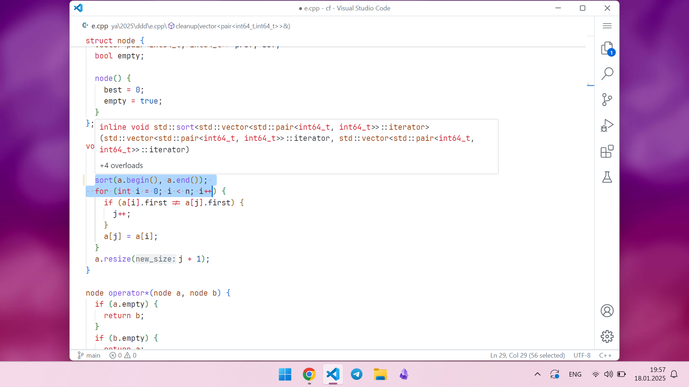

# My competitive programming VSCode setup

It includes:

- [Emacs](https://emacs.org)-like keybindings
- Build by <kbd>Ctrl+Shift+B</kbd>, run if samples in `input.txt` by <kbd>Ctrl+Shift+R</kbd>
- New file by <kbd>Ctrl+x n</kbd>
- Include template when create C++ file
- A lot of snippets (for C++ of course)
- Nice view IMHO (light theme, remove useless parts of design). Theme: `GitHub Light Default`

# Extensions

The main idea of config is that I must can quickly install it on any computer, so I try to use small amount of extensions. The below is full list

- Awesome Emacs Keymap
- C/C++
- Auto Snippets
- advanced-new-file
- GitHub Theme
- InteliCode

for Python:
- Python
- Pylance
- Python Debugger
- Python Indent
- Ruff

maybe also useful:
- vscode-icons (you know)
- 1337-theme (nice dark theme)

# How to install?

Just copy these files into your settings folder and install needed extensions (see above). The suggested version of VSCode is 1.96.4 (my current version)
